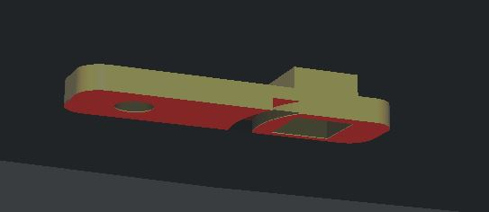
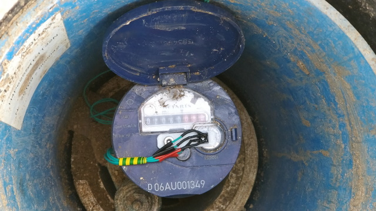
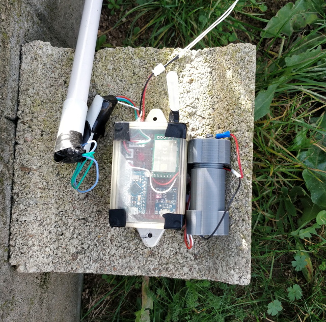

# water-meter

## Forewords

This project aims at getting an analog signal from a water meter and use it for a house automatization system to control the water consumption.

## Specifications

This project uses :

* CNY70 reflective sensor (that includes an infrared emitter and phototransistor)
* Arduino Pro Micro 3.3v
* Solar Panel
* TP4056 (Lithium Battery Charger Module)
* E45-TTL-100 (Wireless transceiver module with LoRa spread-spectrum technology)

## Sensor accuracy

| Timestamp | Raw water meter value | Total liters consumed (from sensor) |  Real water comsumption |  Sensor water  consumption |
|:------------------:|:---------------------:|:-----------------------------------:|:-----------------------:|:--------------------------:|
| 2020/01/26 @ 15h10 | 2064 996 | 0 | 0 | 0 |
| 2020/01/26 @ 17h23 | 2065 045 | 50 | __49__ | __50__ |
| 2020/01/26 @ 19h59 | 2065 279 | 283 | __234__ | __233__ |
| 2020/01/27 @ 17h48 | 2065 488 | 493 | __209__ | __210__ |

## 3D CNY70 Holder

I have designed a [3D CNY70 holder](model3d/watermeter_cny70_holder.stl) that fits on my watermeter.

## In real life

* CNY70 Sensor + custom 3D printed holder on water meter

* Arduino + LoRa transceiver 

